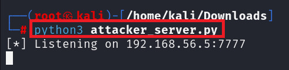
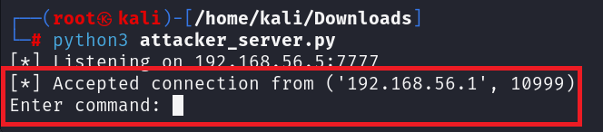
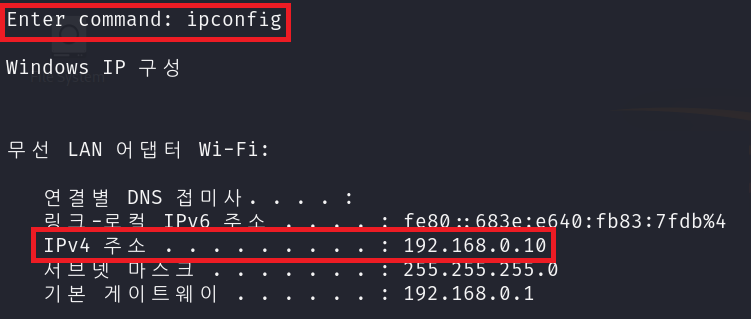
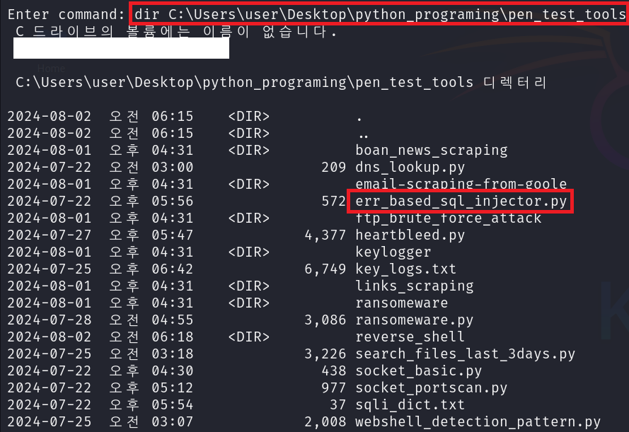
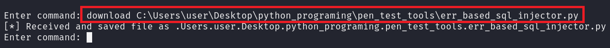
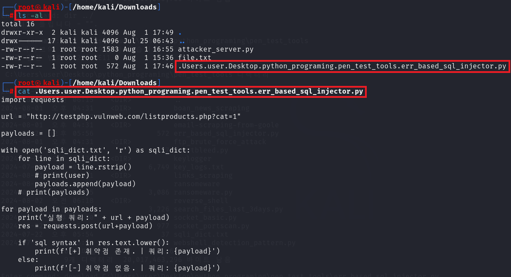

# Reverse Shell Specialized for Windows Local File Download

- 본 저장소의 스크립트들은 피해자의 OS 환경이 **Windows** 일 때를 가정하고, Windows와의 **Reverse Connection** 시, 해당 시스템의 **Local File Download** 기능에 특화되어 있습니다.

# Usage

- 파일 다운로드:
```sh
download <Local-file-path>
```

- 연결 종료:

```sh
Type exit or Ctrl + c
```

# Examples

**수행 환경:**

- **공격자 PC**: 192.168.56.5(**Kali Linux**)
- **피해자 PC**: 192.168.0.10(**Windows 10**)

---

1. 공격자 PC인 **Kali Linux**에서 `attacker_server.py` 실행

```zsh

python3 attacker_server.py

```


<br>
2. 희생자 PC인 **Windows 10**인 환경에서 `reverse_shell.py` 실행

```sh

python reverse_shell.py 

```
<br>
3. 공격자 PC인 Kali Linux에서 **연결 확인** 및 **타겟 IP** 확인






<br>
4. **디렉토리 확인 및 파일 다운로드**


- **디렉토리 확인**



- **파일 다운로드**



- **다운로드 된 파일 확인**
